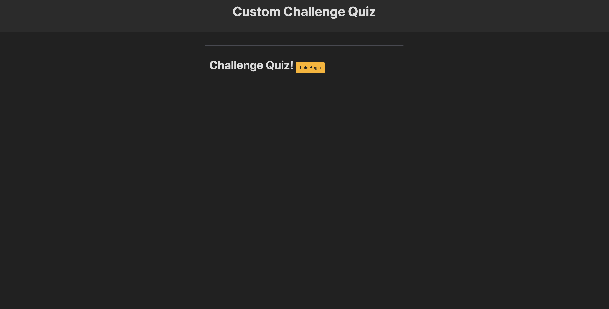
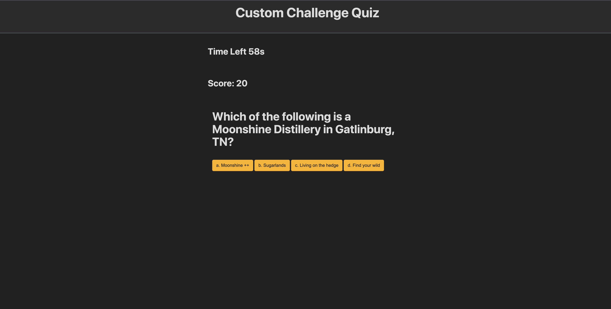
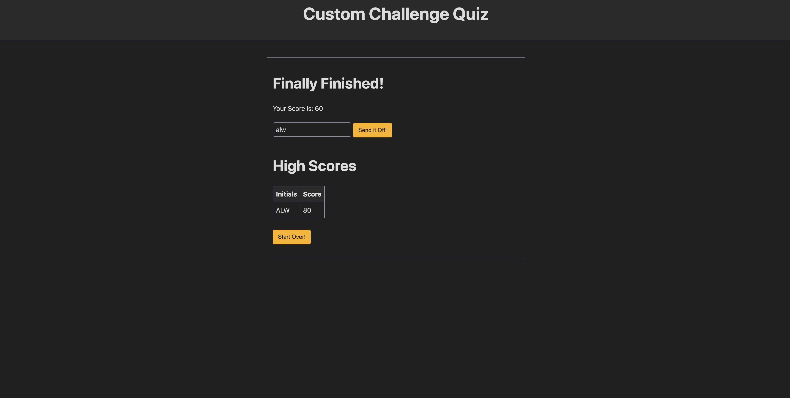

# challenge-quiz

[Link to my project](https://alandis01.github.io/challenge-quiz/)

## table-of-contents
- [Description of project](#description-of-project)
- [Visuals](#visuals)

## description-of-project
I have created a custom quiz displaying different questions for the user to answer correctly or incorrectly. The quiz is timed that timer will subtract from when a question is answered incorrectly. The user is able to store their initials in a High Score local storage. 

## visuals

